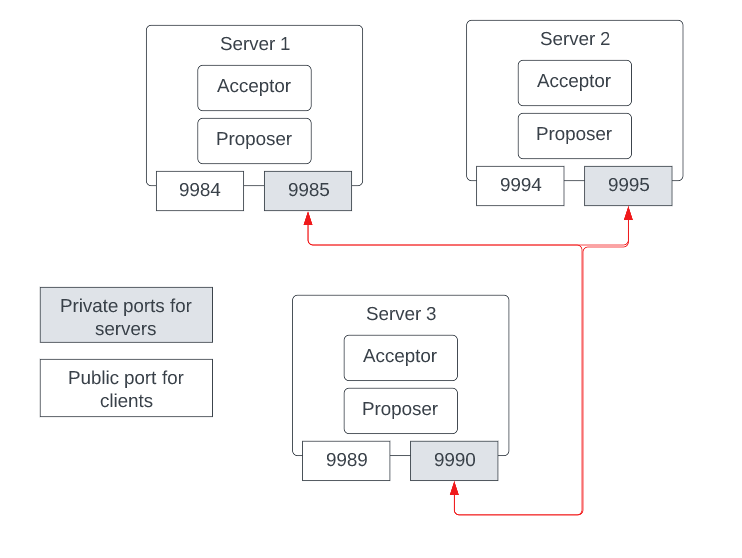
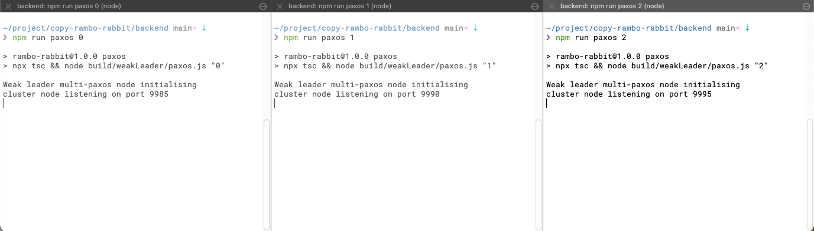

# Backend by Rambo Rabbit

## Architecture

* 3 servers allows a maximum failure of 1 node
* Each server contains an acceptor and a proposer






## For Deployment

**Prerequisites**

1. Install NodeJS [download here](https://nodejs.org/en/).
2. Install npm [using this guide](https://docs.npmjs.com/downloading-and-installing-node-js-and-npm).

**Deploy**

1. Install all dependencies `npm install --only=prod`.
2. Open up 3 terminals each have working directory at `backend`
3. Run the following 3 lines in different servers
    1. `npm run paxos 0`
    2. `npm run paxos 1`
    3. `npm run paxos 2`
4. You can also run different versions of Paxos or naive broadcast
    1. Egalitarian Paxos `npm run epaxos 0`, `npm run epaxos 1 `, and `npm run epaxos 2`
    2. Strong Leader Paxos `npm run strongpaxos 0`, `npm run strongpaxos 1` , and `npm run strongpaxos 2` 
    3. Reliable Broadcast that cannot guarantee consistency  `npm run basic 0`, `npm run basic 1`, and `npm run basic 2`
5. **IMPORTANT!!!**
    * Close all servers before running different variations because we cannot handle Byzantine failures.
    * You might need to refresh your web browser if nothing happens.

**Bot to populate the image**
1. `npm run client 9984 1` where `9984` is the port number to the server, and `1` is 1 out of the 4 possible images


https://user-images.githubusercontent.com/24912454/167295185-ae071778-42c9-431a-8732-e2c59d5ff30d.mov


Bot that tries to propose different colors for the same pixel to different nodes at the same time
1. `npm run single 9984 9989`


https://user-images.githubusercontent.com/24912454/167295181-ba7873c1-6172-4cae-bce8-306195689dc3.mov


## For Development
1. We used Typescript and ESLint for static typechecking
1. All connections are Websocket connections on top of reliable TCP/IP connections 

```
.
├── README.md
├── build (compiled javascript)
├── src (typescript files)
├── node_modules (libraries)
├── .git
vvvvvv dev config files vvvv
├── .eslintignore
├── .eslintrc.json
├── .prettierrc.json
├── tsconfig.json
vvvvvv config files vvvvvvvv
├── .gitignore
├── package-lock.json 
└── package.json
```

