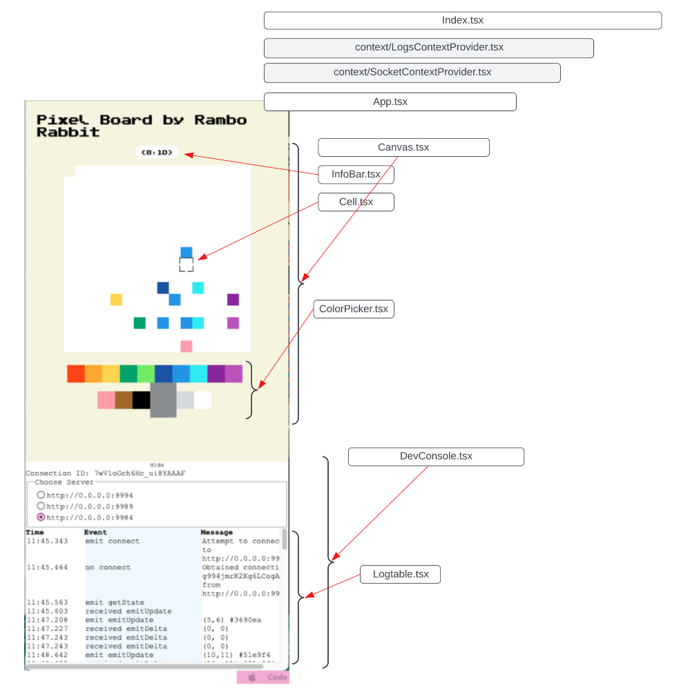

# Frontend by Rambo Rabbits

https://user-images.githubusercontent.com/24912454/167292633-72feef42-68c3-45c7-a90e-4ddcfcc242c1.mov

## For Deployment

**Prerequisites:**

1.  latest `npm` installed
2. latest `node` installed

**Compatible with:**

All stable versions Chrome, Firefox, and Safari

**Deploy**

1. Make sure you are in the `frontend` folder
2. `npm install --only=prod` will only install the required 
3.  `npm start` will start the frontend server on local port `3000`

## For Development

**Overview**

* This project uses **ReactJS** library
* Communication with backend server is down using **Websocket** though **Socket.io-client** library
* We use **ESLint** and **Typescript** for static type checking and semantics/logic error checking.
* We use **Prettier** to maintain a consistent code layout
* We use React-Scripts to manage the project 

**Component Relation Diagram**

